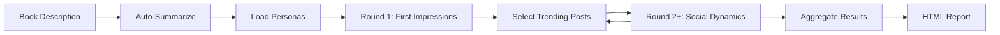
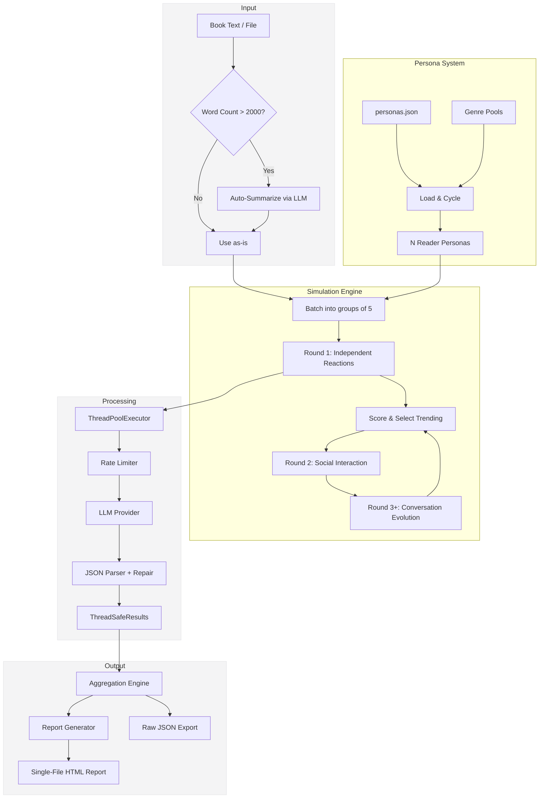
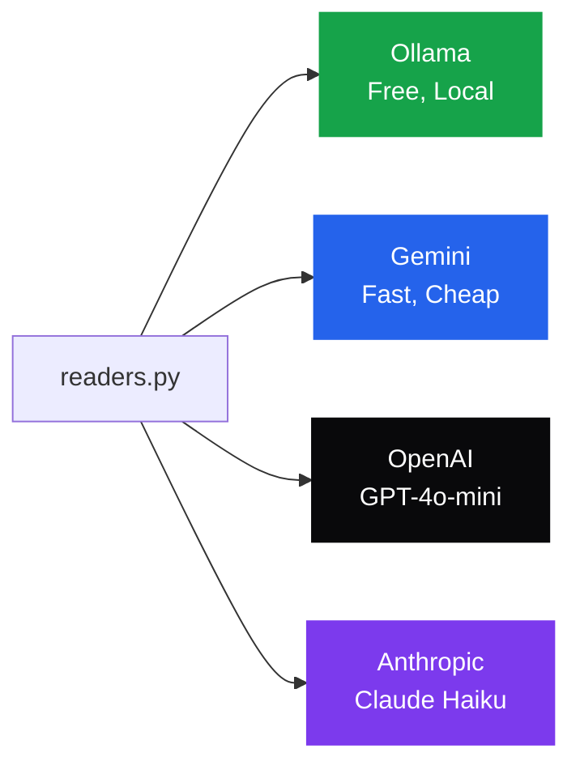
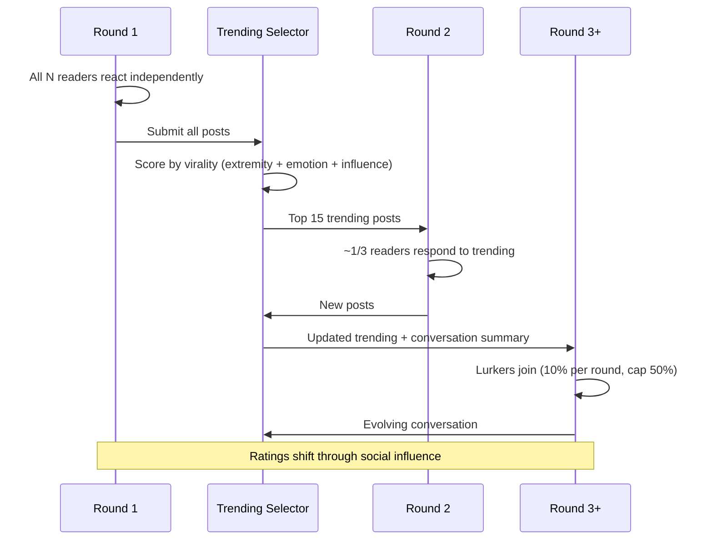
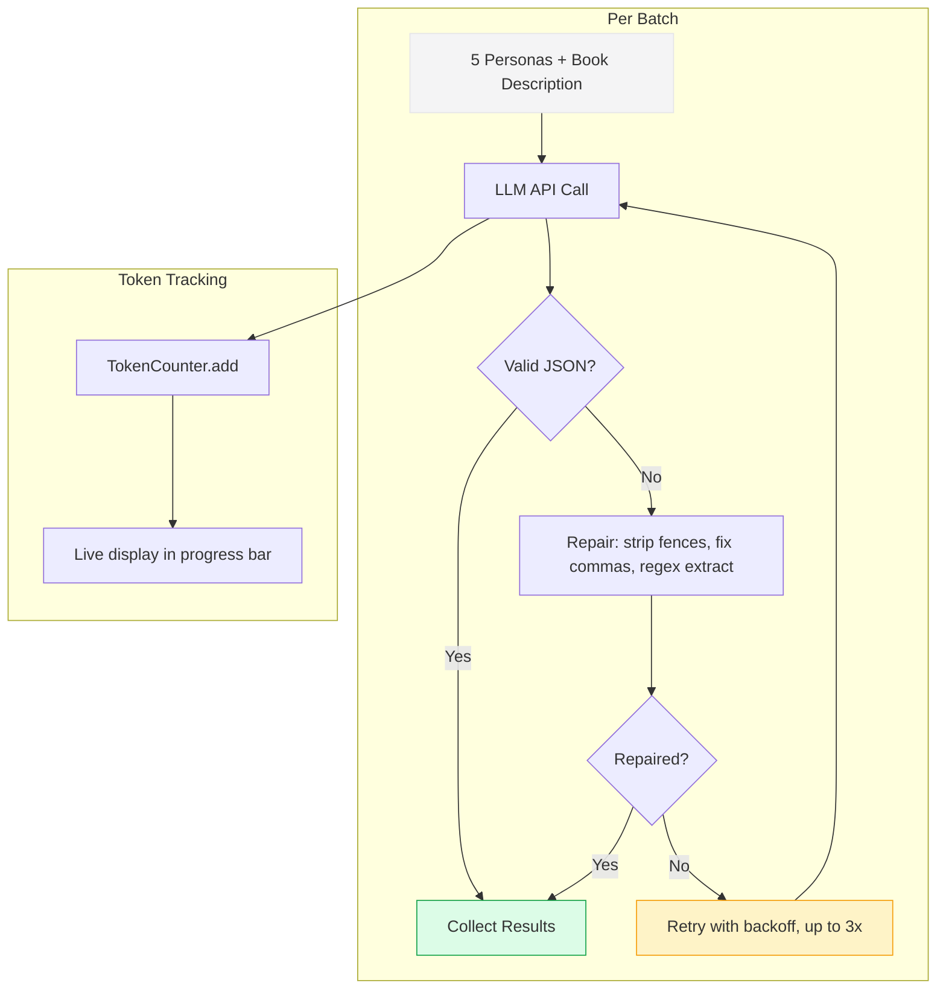

# Readers

**Up to 500,000 AI readers judge your book before you publish.**

A multi-agent reader simulation engine that generates hundreds to thousands of unique AI reader personas — each with their own personality, platform habits, genre preferences, and demographic profile — then simulates them reacting to your book across multiple rounds of social interaction.

The result: a premium HTML report with predicted ratings, demographic breakdowns, purchase intent, controversy analysis, virality scoring, and actionable next steps.

Made by **Eeman Majumder**

---

## How It Works



You provide a book description (or full manuscript). Readers loads diverse AI personas, sends them through an LLM in batches, collects structured reactions, then runs social rounds where readers see each other's viral posts and respond — creating realistic pile-ons, controversy, and consensus shifts.

---

## Sample Output

> **[View a full sample report](examples/sample_output/sample_report.html)** — download and open in your browser.

The report includes 19 sections:

| Section | What It Shows |
|---------|---------------|
| Hero & Stats | Average rating, reader count, key metrics at a glance |
| Rating Distribution | Animated bar chart showing 1-5 star breakdown |
| Emotional Reactions | What readers felt — intrigued, bored, angry, obsessed, etc. |
| Platform Breakdown | How BookTok vs Goodreads vs Reddit readers reacted differently |
| PRISM Demographics | Per-segment ratings across 8 market demographics |
| Confidence Metrics | Consensus score, polarization index, margin of error |
| Purchase Intent | Would they buy? At what price? Per-segment purchase rates |
| Extremes | Top 5 harshest critics and top 5 biggest fans, with full reviews |
| Social Feed | Simulated social media posts across all rounds |
| Controversies | Debate points flagged by readers |
| DNF Analysis | Who would quit and why |
| Timeline Chart | Rating evolution across rounds (canvas-rendered) |
| Virality Gauge | SVG radial gauge (0-100) |
| Recommendations | Data-driven action items based on your specific results |
| Share Card | Screenshot-ready summary for social media |

---

## Architecture



---

## Provider Support



| Provider | Default Model | Cost / 1K Readers | Speed | API Key Required |
|----------|---------------|-------------------|-------|------------------|
| **Ollama** | qwen3.5:0.8b | Free | ~30 min | No |
| **Gemini** | gemini-2.5-flash | ~$0.25 | ~8 min | Yes |
| **OpenAI** | gpt-4o-mini | ~$0.70 | ~10 min | Yes |
| **Anthropic** | claude-haiku-4-5 | ~$1.00 | ~12 min | Yes |

---

## Quick Start

### 1. Install

```bash
git clone https://github.com/Eeman1113/Readers.git
cd Readers
pip install -r requirements.txt
```

### 2. Run

```bash
# Free, local (requires Ollama running)
python readers.py --file examples/my_book_idea.txt --readers 100

# Cloud (recommended — fast and cheap)
python readers.py --file examples/my_book_idea.txt --provider gemini --readers 1000

# Full simulation with social rounds
python readers.py --file examples/my_book_idea.txt --provider gemini --readers 1000 --rounds 5 --workers 5
```

### 3. View Report

The HTML report opens automatically in your browser when the simulation completes. Reports are saved to `output/`.

---

## Multi-Round Social Simulation



Each round reveals how opinions evolve:
- **Round 1** — Raw first impressions, no social influence
- **Round 2** — Readers react to the most viral posts
- **Round 3+** — Conversation deepens, lurkers join, consensus or polarization emerges

---

## PRISM Demographic Segmentation

Every simulation breaks down results across 8 market segments:

| Segment | Profile | What They Care About |
|---------|---------|---------------------|
| **Affluent Bookworms** | High spend, literary-focused | Awards, prose quality, hardcovers |
| **Young Urban Readers** | BookTok-driven, trend followers | Virality, aesthetics, audiobooks |
| **Suburban Families** | Escapism seekers, book clubs | Comfort reads, relatable characters |
| **Academic Readers** | Critical, intellectually driven | Depth, originality, structure |
| **Budget Readers** | KU subscribers, high volume | Entertainment value, series potential |
| **Senior Traditionalists** | 55+, established taste | Familiar genres, physical books |
| **Diverse Explorers** | Representation-focused | Own voices, multicultural stories |
| **Genre Devotees** | Deep fans, convention-goers | Trope execution, series worldbuilding |

---

## All CLI Options

```
python readers.py [OPTIONS]

Input (one required):
  "text"              Book description as inline text
  --file, -f PATH     Path to book description file

Provider:
  --provider, -p      ollama | gemini | openai | anthropic (default: ollama)
  --model, -m         Override default model name
  --api-key, -k       API key (or set via .env file)

Simulation:
  --readers, -r       50 to 500,000 (default: 1000)
  --rounds            1 to 100 (default: 2)
  --batch-size, -b    Personas per LLM call (default: 5)
  --workers, -w       Parallel API calls, 1-20 (default: 1)
  --genre, -g         romance | thriller | fantasy | scifi | literary | nonfiction | ya

Output:
  --output, -o        Custom output path
  --no-open           Don't auto-open report in browser
  --ollama-host       Custom Ollama server URL
```

---

## Scaling

| Readers | Use Case | Time (Gemini, 5 workers) | Cost |
|---------|----------|--------------------------|------|
| 100 | Quick test | ~2 min | ~$0.03 |
| 1,000 | Standard simulation | ~8 min | ~$0.25 |
| 10,000 | Deep demographic analysis | ~1 hr | ~$2.50 |
| 100,000 | Large-scale prediction | ~10 hr | ~$25 |
| 500,000 | Maximum scale | ~2 days | ~$125 |

---

## File Structure

```
Readers/
├── readers.py               # Main simulation engine
├── report_generator.py      # HTML report builder
├── readers_gui.py           # Tkinter GUI (Windows)
├── generate_personas.py     # Deterministic persona generator
├── pricing.json             # Per-provider cost estimates
├── requirements.txt         # Python dependencies
├── personas.json            # 1,000 default personas
├── personas_5000.json       # 5,000 persona pool
├── personas_10000.json      # 10,000 persona pool
├── personas_romance.json    # Genre-tuned: romance
├── personas_thriller.json   # Genre-tuned: thriller
├── personas_fantasy.json    # Genre-tuned: fantasy
├── personas_scifi.json      # Genre-tuned: sci-fi
├── personas_literary.json   # Genre-tuned: literary fiction
├── personas_nonfiction.json # Genre-tuned: nonfiction
├── personas_ya.json         # Genre-tuned: young adult
├── swarm_visualization.html # Animated wait screen
├── examples/
│   ├── my_book_idea.txt     # Sample book description
│   ├── sample_book.txt      # Full manuscript example
│   └── sample_output/
│       ├── sample_report.html  # Example HTML report
│       └── sample_report.json  # Example raw data
├── ARCHITECTURE.md          # Full technical documentation
├── USERGUIDE.md             # Setup and usage guide
└── output/                  # Generated reports (gitignored)
```

---

## Data Flow



---

## License

MIT
